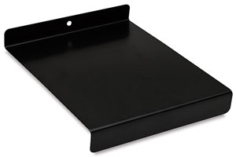

# block-printing
notes and information about block printing
* this guide is geared towards printing on shirts but will suffice for paper as well, just don't buy the fabric materials :)

## materials:
* soft lineoleum blocks
* linoleum carving tool & blades
* block printing ink for fabric
    * don't get screen printing ink
* ink well / bench hook
    * 
    * the metal speedball one doubles as an ink well and a bench hook for carving
* brayer roller
    * always store this with the roller off any surface, it will deform over time and become ruined.
* shirts
    * gildan 2000 blanks are good
* pencil with dark and soft lead
* pen cap
    * a smooth rounded thing for rubbing your traced design into the uncarved linoleum block
* scrap fabric or paper for making a test design of your carved lineoleum block
* cardboard or a cereal box that is as big as your linoleum block or bigger
    * a book or a laptop will also work

## guide:
1. wash and dry the shirt you'll print on
1. **carving**
    1. make a design
        * I recommend creating your design and then taking a picture of it and printing it.
        * scale your image to be proportional to your linoleum block. Preview on MacOS can resize an image via the menu bar under `Tools > Adjust Size`.
    2. trace over your design with pencil that has soft lead and press hard
    3. tape your traced design to your linoleum block
        * be careful not to press your design into the block
    4. rub the traced areas into the linoleum block
    5. remove the paper and carve the design into the linoleum block
        * be careful not to carve deeper than half the block's depth
        * you can use your bench hook to hold the linoleum block in place while you carve, but I prefer to hold it with my hands.
2. **printing**
    1. clear any loose shavings from the lineolum block
    2. insert the hard surface into the scrap fabric under the area where you want to print your design
    3. place a quarter-sized dollup of ink on your ink well
        1. rub the dollup into a square about 1.5 times the length of your brayer roller
            * make sure the brayer is entirely covered
        2. start a second square of ink around the same size as the first
            * the goal with this square of ink is to prevent over-inking the linoleum block
            * small peaks and troughs should form in the ink well and on the roller. 
            * the roller should make a tacky sound as it rolls across the ink well.
    4. perform 2-3 cycles of inking the brayer and covering the entire design on your linoleum block
    5. make a test print of your linoleum block on the scrap fabric or paper
    6. if you're happy with the test print, and proceed to re-apply ink to the linoleum block and print on fabric 
        * make sure you have enough ink in your ink well
        * otherwise, return to step 5. and continue carving your design
3. let your shirt dry the recommended amount of time for your ink.

---

## sources:
* Helpful video about block printing on shirts: https://www.youtube.com/watch?v=KHx-XfegugQ
* video about block printing on fabric: https://www.youtube.com/watch?v=6GpmdCqDSZI

# TODO:
* add pictures for materials and guide sections
